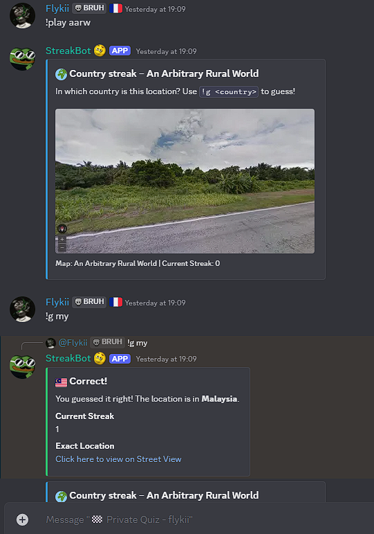
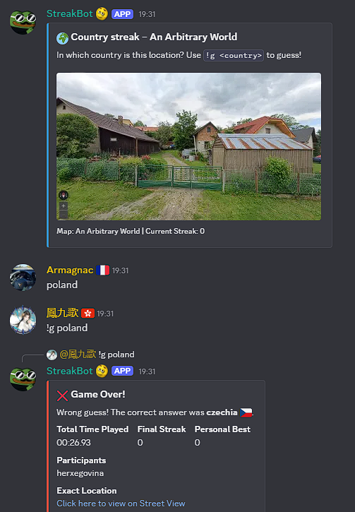
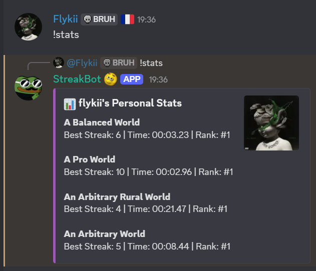
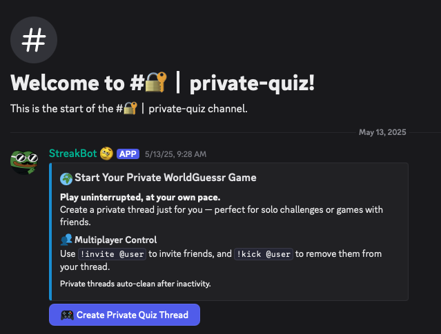
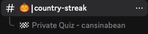
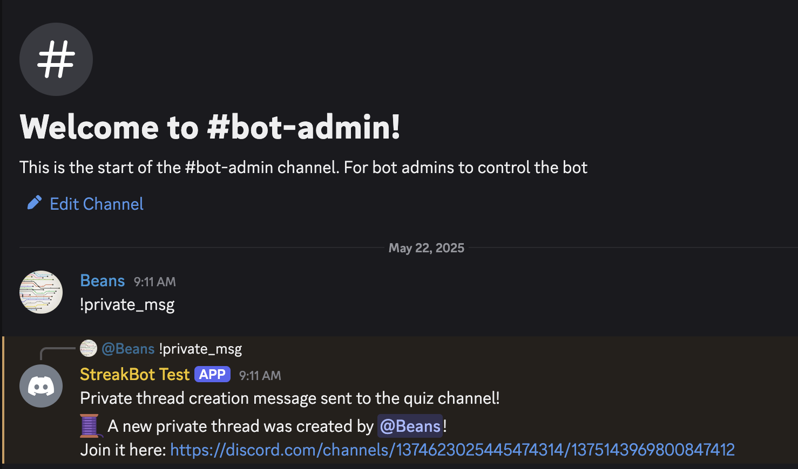

# 🌍 **StreakBot**

Made by **Flykii** for the [WorldGuessr Discord](https://discord.gg/nfebQwes6a)  
Play Worldguessr at https://worldguessr.com
Feel free to use it on your own server!

Test your geography knowledge with country streak challenges based on real Street View locations!  
Compete solo or with friends, track your best streaks, and climb the leaderboard.




---
## 🕹️ **Available Commands**
### **Players**
| Command | Description |
| ------- | ----------- |
| `!help` | Show the help message |
| `!play` | Start a new quiz with a random map |
| `!play <map>` | Start a new quiz with the specified map |
| `!g <country>` | Submit your guess for the current quiz |
| `!maps` | Show all available maps |
| `!stats` | Show your personal stats and records |
| `!leaderboard <map>` | Show the leaderboard for a specific map |
| `!invite @user` | Invite a user to your private thread *(only works in threads)* |

### **Admins**
| Command | Description |
| ------- | ----------- |
| `!help_admin` | Show the admin help message" |
| `!private_msg"` | "Create an announcement message to create private quizzes" |

---


---
## **Environment**
Create an `.env` file containing variables in this format:
```js
BOT_TOKEN=
CREATE_QUIZ_CHANNEL_ID=
QUIZ_CHANNEL_ID=
ADMIN_CHANNEL_ID=
```
- `BOT_TOKEN`: Your Discord bot token
- `CREATE_QUIZ_CHANNEL_ID`: The channel where the "Create Private Thread" button will be posted
  
- `QUIZ_CHANNEL_ID`: The main channel where quizzes are played and where threads will be created
  
- `ADMIN_CHANNEL_ID`: The channel where admins can control the bot
  

---
## **Development**
Run `npm install`
If you want to hot reload, use `npm run dev`
If no hot reload is necessary, use `node src/streakbot.js`