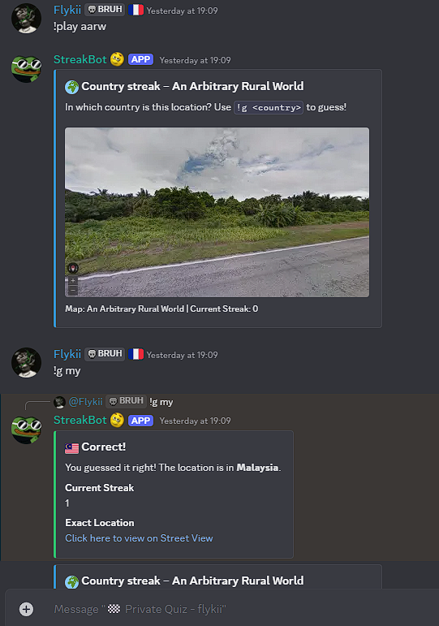
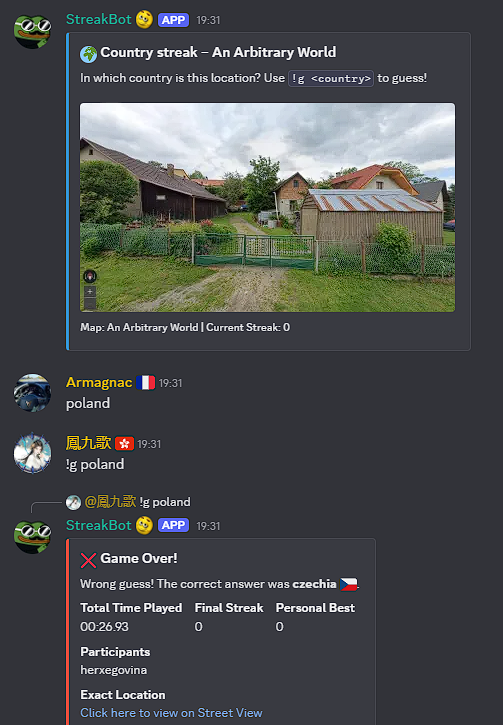
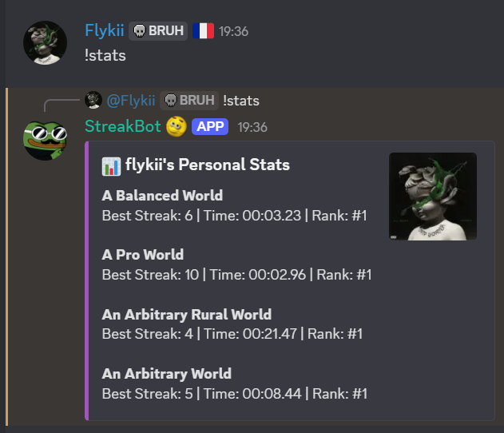
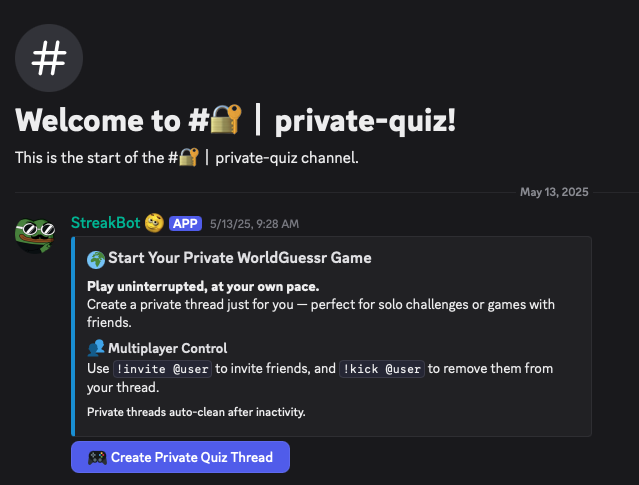
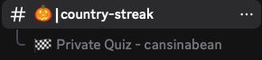
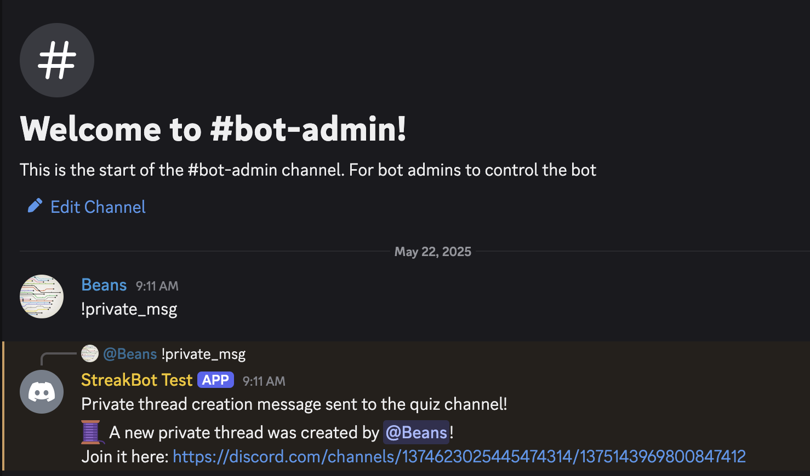

# 🌍 **StreakBot**

Made by **Flykii (@flykii)** and **Beans (@cansinabean)** for the [WorldGuessr Discord](https://discord.gg/nfebQwes6a)
Play Worldguessr at https://worldguessr.com.
Feel free to use it on your own server!

Test your geography knowledge with country streak challenges based on real Street View locations!  
Compete solo or with friends, track your best streaks, and climb the leaderboard.




---
## 🕹️ **Available Commands**
Note that most commands are text-based for speed, but admin commands often use slash commands for complex interactions and to hide actions from players. The default prefix is `!`, but you may change this.

### **Players**
| Command | Description |
| ------- | ----------- |
| `!help` | Show the help message |
| `!play` | Start a new quiz with a random map |
| `!play <map>` | Start a new quiz with the specified map |
| `!g <country>` | Submit your guess for the current quiz |
| `!maps` | Show all available maps |
| `!invite <@user>` | Invite a user to your private thread *(only works in threads)* |
| `!kick <@user>` | Kick a user from your private thread *(only works in threads)* |
| `!map/!locs/!locations/!distribution <map>` | Show the distribution map for a specific map |
| `!stop` | Stop the current quiz and show the final streak |
| `/stats <type> <@user>` | Show the personal stats for a user (solo or multi) |
| `/leaderboard <type> <map>` | Show the leaderboard for a map (solo or multi) |

### **Admins**
| Command | Description |
| ------- | ----------- |
| `!help_admin` | Show the admin help message |
| `!private_msg"` | Create an announcement message to create private quizzes |
| `/create-channels` | Create channels under category StreakBot for the bot |
| `/setup <create_quiz_channel> <quiz_channel> <admin_channel>` | Easily configure bot channels |
| `/add-map <name> <aliases> [distribution]` | Add a map with aliases and a distribution map image (optional). The aliases should include the original map name. |
| `/delete-map <name>` | Deletes a map from being able to be played. You may enter an alias. |

---


---
## **Environment**
Create an `.env` file containing variables in this format:
```js
BOT_TOKEN=
CLIENT_ID=
```
- `BOT_TOKEN`: Your Discord bot token
- `CLIENT_ID`: Identifies bot within Discord Developer portal

---
## **Setup**
1. Invite the bot to your server
2. Use `/create-channels` to create the channels for the bot (optional)
3. Use `/setup` to set up the bot channels
    - `create-private-quiz-channel`: The channel where the "Create Private Thread" button will be posted
    
    - `quiz-channel`: The main channel where quizzes are played and where threads will be created
    
    - `admin-channel`: The channel where admins can control the bot
    

---
## **Development**
1. Run `npm install`.
2. Register slash commands with `node src/register_commands.js`. Note that this does not need to be run often, so it is in a separate file.
3. Run `node src/streakbot.js` to start the bot. If you want hot reload with nodemon, use `npm run dev`.
